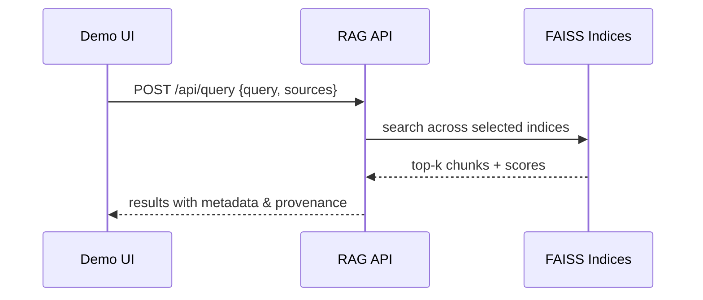

# AI-Driven LEED v4.1 Compliance Assistant: System Methodology

## Abstract
This document details a practical, end-to-end methodology for building an AI assistant that accelerates LEED v4.1 BD+C pre‑compliance and documentation. The system ingests rating system PDFs, guides, checklists, forms, and calculator metadata into a unified RAG corpus; normalizes and chunks information with rich metadata; indexes it using multi‑index FAISS; and exposes robust retrieval via a web API and a lightweight demo UI. Emphasis is placed on provenance, reproducibility, modularity, and extensibility to additional LEED systems.

## 1. Introduction
LEED certification demands intensive document review, cross‑referencing, and repeatable verification. Our system operationalizes a pipeline that: (i) extracts structured content from primary and auxiliary LEED sources; (ii) normalizes metadata and composes semantically coherent chunks; (iii) builds efficient vector indices per source type; and (iv) serves multi‑source retrieval with clear provenance. The included demo (“CertiSense”) demonstrates interactive exploration and document‑aware analysis.

## 2. Data Sources and Scope
We target broad coverage across the BD+C family while remaining extensible:
- Primary PDFs: v4.1 BD+C Rating System and Guide (`data/leed_pdfs/BD+C/*`).
- Derived structured data: previously extracted credits and chunks (`data/raw/*`, `outputs/*leed_*`).
- Checklists and mapping: `outputs/leed_checklist_*.json(l)`, `outputs/credit_mapping/**`.
- Forms and calculators: `outputs/sample_forms*.jsonl`, `outputs/calculator_*.json(l)`.

The objective is to capture intents, requirements, options, submittals, applicability, referenced standards, related credits, and practical guidance, enabling accurate, auditable retrieval.

## 3. Document Processing and Extraction
### 3.1 Extraction Strategy
We combine text extraction with resilient fallbacks:
- pdfplumber for layout‑aware text.
- OCR fallback via pdf2image + Tesseract for scanned/low‑text pages (600 DPI).
- PyMuPDF (fitz) text extraction as a final safety net when OCR or pdfplumber underperform.

### 3.2 Section‑Aware Parsing
The advanced extractor (`src/extract_leed_credits_advanced.py`) recognizes section headers such as Intent, Requirements, Options, Submittals (Documentation), Applicability, Equations, Related Credits, Referenced Standards, Step‑by‑Step, and Guidance. It composes coherent credit records, assigns page provenance, and computes lightweight quality metrics (completeness and validations).

### 3.3 Outputs
For each run, we materialize multiple views into `outputs/advanced_extraction/`:
- Credits JSON (record‑level fidelity).
- RAG chunks JSONL (search‑ready composition).
- CSV/Excel for analyst workflows and QA.

```mermaid
flowchart LR
  A[LEED PDFs (BD+C)] --> B[pdfplumber]
  A --> C[OCR (pdf2image+Tesseract)]
  A --> D[PyMuPDF]
  B & C & D --> E[Section-aware Parser]
  E --> F[Credits JSON]
  E --> G[RAG Chunks JSONL]
  E --> H[CSV/Excel]
```

## 4. RAG Knowledge Construction
### 4.1 Normalization & Chunking
`src/build_rag_corpus.py` consolidates heterogeneous sources into a unified chunk schema with metadata:
- Harmonized fields: `credit_code`, `credit_name`, `type`, `category`, `points_min/max`, `version`, `pages`, `source`, `doc`.
- Chunk text preserves section structure (intent, requirements, options, etc.) to improve semantic recall and precision.

### 4.2 Multi‑Source Ingestion
The builder sweeps:
- Credits: `data/raw/leed_credits.json`, `outputs/leed_credits.json`, `outputs/leed_guide_credits.json`, `outputs/leed_checklist_credits.json`.
- Chunks: `data/raw/rag_chunks.jsonl`, `outputs/leed_rag_chunks*.jsonl`, `outputs/leed_guide_rag_chunks.jsonl`, `outputs/leed_checklist_rag_chunks.jsonl`, `outputs/advanced_extraction/*_rag_chunks_*.jsonl`.
- Forms/Calculators: `outputs/sample_forms*.jsonl`, `outputs/calculator_training_data*.jsonl`, plus flattened `outputs/calculator_metadata.json`.
- Mapping: `outputs/credit_mapping/**/*.{json,jsonl}`.

### 4.3 Embeddings & Indexing
We use `sentence-transformers/all-MiniLM-L6-v2` (384‑dim). All embeddings are L2‑normalized; FAISS IndexFlatIP performs cosine‑equivalent retrieval.

We build multiple indices to support routing and analysis:
- `index_credits`: rating system + checklists + advanced extraction.
- `index_guide`: guide narratives and contextual text.
- `index_forms`: forms and calculator artifacts.
- `index_all`: merged view for general queries.

```mermaid
flowchart TB
  S1[Credits JSON/JSONL] --> N[Normalizer]
  S2[Guide Chunks] --> N
  S3[Forms/Calculators] --> N
  S4[Checklists/Mapping] --> N
  N --> E[Embedder (all-MiniLM-L6-v2)]
  E --> I1[FAISS: index_credits]
  E --> I2[FAISS: index_guide]
  E --> I3[FAISS: index_forms]
  E --> I4[FAISS: index_all]
```

## 5. API and Front‑End Integration
### 5.1 Web API (RAG Retrieval)
`src/leed_rag_api.py` loads multi‑indices when available and exposes:
- `GET /api/status`: system health and available sources.
- `POST /api/query`: accepts `{query, limit, sources}` to search one or more indices; returns ranked chunks with provenance.
- `GET /api/credits`: credit list (combined view), useful for UI selection.
- `POST /api/analyze`: document text vs. selected sources and target credits; returns relevant evidence.



### 5.2 Demo UI (CertiSense)
The demo (`demo_landing_page/`) provides a chat‑like interface that:
- Queries the API and renders ranked evidence with chunk metadata.
- Performs simple document analysis by sending the uploaded text to `/api/analyze`.
- Detects and clearly reports API connectivity issues.

## 6. Evaluation Methodology
We verify retrieval quality and coverage with three classes of queries:
1) Credit‑specific (e.g., “EA Optimize Energy Performance”).
2) Topic‑based (e.g., “indoor air quality assessment”).
3) Compliance/documentation (e.g., “what documentation is required for LEED credits?”).

Metrics include top‑k hit rate, qualitative relevance review, and distribution across indices. Comprehensive scripted checks are provided (`src/test_api_client.py`, `src/rag_demo.py`, `src/test_real_data.py`).

## 7. Results (Current Build)
The latest unified corpus comprises:
- credits: 1,742 chunks
- guide: 332 chunks
- forms/calculators: 69 chunks
- all: 2,143 chunks

Multi‑source retrieval returns relevant evidence with sub‑second latency on a local GPU/CPU environment.

## 8. System Components Summary
- Extraction: `src/extract_leed_credits_advanced.py`
- Corpus build: `src/build_rag_corpus.py`
- Indices: `models/index_*.faiss/.json`
- API: `src/leed_rag_api.py`
- Demo server: `src/demo_server.py`
- Optional platform integration: `src/enhanced_leed_platform.py`, `src/leed_platform.py`

## 9. Limitations
Coverage is bounded by available sources and extraction quality; scanned content may reduce fidelity despite OCR. The public API currently serves retrieval (not generative answers) to prioritize auditability and factual grounding; a report generator (`google/gemma-2-9b-it`) is available for offline drafting.

## 10. Future Work
Extend to ID+C and O+M; include USGBC addenda/errata; add hybrid reranking (lexical + semantic); provide citation anchors with page spans; and introduce authentication, persistence, and workload isolation for multi‑tenant deployment.

## 11. Reproducibility & How to Run
1) Install: `pip install -r requirements.txt`  
2) Build corpus: `python src/build_rag_corpus.py`  
3) Run API: `python src/leed_rag_api.py` → http://localhost:5000  
4) Run demo: `python src/demo_server.py` → http://localhost:3000  
5) Sample query (PowerShell):
```
$body = @{query="EA Optimize Energy Performance"; limit=3; sources=@("credits","guide")} | ConvertTo-Json
Invoke-WebRequest -Uri "http://localhost:5000/api/query" -Method POST -Body $body -ContentType "application/json"
```

## 12. Ethical & Operational Considerations
We expose metadata and provenance for every answer to support audits and reduce hallucinations. The system is designed for on‑premises deployment to keep proprietary project documents private.
